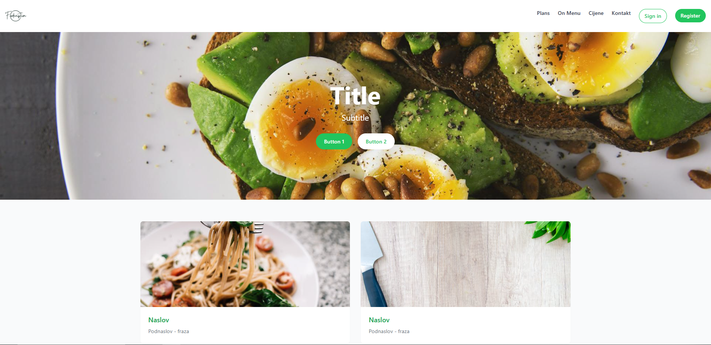

# 🍽️ Foodcription

**Foodcription** je web aplikacija za **pretplatu na zdrave obroke**!  
Korisnici mogu pregledavati gotove jelovnike i pretplatiti se na svakodnevne isporuke nutritivno bogatih, ukusnih jela, spremnih za užurbani način života.

---

## 🚀 Tech Stack

- **Frontend**:
  - ⚛️ React (Vite setup)
  - 🎨 TailwindCSS za brzo i responzivno stiliziranje
- **Backend** (uskoro):
  - ☕ Spring Boot (Java 21)
- **Baza podataka**:
  - 🛢️ MariaDB
- **Autentikacija**:
  - ✉️ Vlastiti login sustav (Spring Security) + mogućnost Google prijave
- **Deployment**:
  - GitHub (za verzioniranje)

---

## 📋 Trenutno implementirano

- ✅ Dizajniran landing page s hero sekcijom, karticama i promotivnim bannerom
- ✅ Responzivan dizajn prilagođen mobilnim uređajima
- ✅ Pripremljena struktura za login / signup funkcionalnosti

---

## 🔥 Što dolazi uskoro

- 🔐 Puna korisnička autentikacija (email + Google OAuth login)
- 📦 Backend API za upravljanje korisnicima, narudžbama i pretplatama
- 📈 Admin dashboard za upravljanje jelima i cijenama
- 🛠️ Automatizacija deploya na server

---

## 📸 Screenshot

---

> "Bringing healthy, ready-to-eat meals to your doorstep – with just one click."
