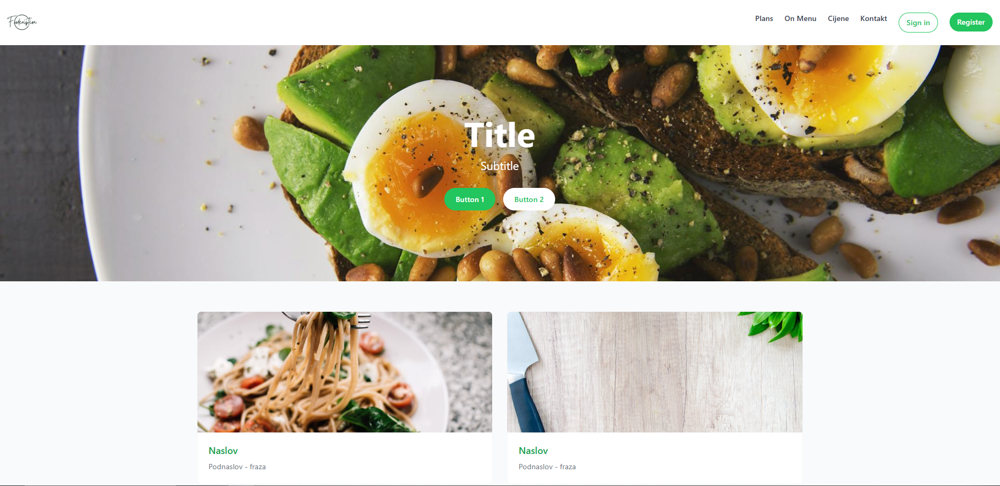

# 🍽️ Foodcription

**Foodcription** is a web application for **healthy meal subscriptions**!  
Users can browse curated menus and subscribe to daily deliveries of nutritious, delicious meals designed for busy lifestyles.

---

## 🚀 Tech Stack

- **Frontend**:
  - ⚛️ React (Vite setup)
  - 🎨 Tailwind CSS for fast, responsive styling
- **Backend** (coming soon):
  - ☕ Spring Boot (Java 21)
- **Database**:
  - 🛢️ MariaDB
- **Authentication**:
  - ✉️ Custom login system (Spring Security) with Google sign-in support
- **Version Control**:
  - GitHub

---

## 📋 Currently Implemented

- ✅ Landing page featuring a hero section, cards and a promotional banner
- ✅ Responsive, mobile-friendly design
- ✅ Initial structure for login and signup functionality

---

## 🔥 Coming Soon

- 🔐 Full user authentication (email and Google OAuth login)
- 📦 Backend API for managing users, orders and subscriptions
- 📈 Admin dashboard for managing meals and pricing
- 🛠️ Automated server deployment

---

## 📸 Screenshot

---

> "Bringing healthy, ready-to-eat meals to your doorstep – with just one click."
